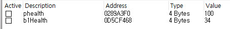

# win32API - Assault Cube ESP - 값 찾기

FPS 게임의 ESP 중에 가장 기본적인것이 에임봇인데, 에임봇이 선행되려면 화면에서 상대방의 정보를 읽어오는것이 먼저가 되어야 한다. 

일단 당장은 화면 정보를 읽어오는건 잘 모르겠으니 , 게임 데이터상에서 플레이어들의 정보를 가져오는걸 우선적인 목표로 해보자. 

지뢰찾기랑 비슷하게 인접한 메모리 영역에 플레이어 데이터가 모여있다고 가정하고 진행해보자.  플레이어의 기본 체력이 100이니, 몇대 맞으면 100에서 변할 것이라고 예상하고 값을 바꿔가면서 메모리 번지를 찾아보자. 

플레이어의 체력 데이터를 채우고 줄이고 하면서 가리키는 포인터를 찾아간다. 



찾아온 데이터는 메모리에 그냥 올라가 있는 값으로, 메모리상에서 정적이지 않고 계속 변할 값이다. 해당 값을 가리키는 정적인 포인터를 찾아놔야 프로세스를 재 실행하더라도 제대로 값을 읽어올 수 있을것이다. 

그러므로 해당 값을 가리키는 포인터를 찾기 위해 치트엔진의 포인터 검색기능과 브레이크 포인트 , 필터링 기능을 사용하자. 


해당 값에 대해 포인터 스캔을 진행하고, 스캔한 값을 저장할 파일을 지정해주면 다음과 같이 결과창이 나온다. 


이중에 원하는 포인터를 한번에 찾을수는 없다. 특정 메모리 값에 쓰기/엑세스 시에 어디서 동작이 발생하는지를 찾고, 어떤 포인터와 오프셋을 통해 값에 엑세스 하는지를 역으로 추적해 올라갈 수 있다. 


filter out 기능을 이용하거나, 해당 메모리 영역에 직접 breakpointer 를 걸어서 어떤 명령어가 실행될 떄 메모리에 접근하는지를 찾으면 된다. 이는 일반적인 동적 디버거의 기능과 동일한 기능으로, 전자는 trace기능과 동일하다고 보면 될듯. 

 


체력에 변화가 생기면 두개의 명령어가 해당 메모리에 접근하는걸 볼 수 있다. 첫번째 명령어가 sub 명령을 실행하므로 플레이어 체력을 감소하는 명령이라고 가정하고 계속 분석을 진행한다. 


값이 변화된것을 가지고 포인터 스캐너에서 리스캔을 진행하면 포인터의 갯수를 많이 줄일 수 있으나, 이것만을 가지고 실제 포인터를 찾아 올라가기는 쉽지 않다. 

따라서, 게임을 종료 한 뒤에 새로 켰을때 내부 메모리가 변화하는것을 이용하여 , 껏다가 켜도 동일 위치에서 포인터를 참조한다면 해당 위치가 정적 위치라고 판단할 수 있으니 이를 통해 체력 포인터를 찾아 올라가보자. 

게임을 재시작한 다음,  rescan - only filter out invalid pointers 를 선택하면 현재 유효하지 않은 메모리들을 참조하는 값들은 걸러진다.  


이때 offset을 가지고 필터링 해볼 수도 있는데, [값+offset] 형태로 포인터에 접근하는 명령어일 경우, 해당 offset을 필터링 조건에 넣어서 포인터를 찾아갈 수도 있다. 이러한 동작들을 적절하게 섞어가며 유효한 포인터를 찾는 과정을 거치면 되는데, 어셈블리 명령어를 더 분석해보면 정확하게 포인터를 찾을 수 있다.  치트엔진에서 제공하는 디스어셈블러를 활용하자.


무려 콜스택도 보여준다.  체력 감소 구문을 지나면 다음과 같은 어셈이 나오는데 


아까 ebx+4를 사용했고, ebx가 인자로 전달될 떄 esi+f4로 전달되었으므로 저 esi를 역으로 찾아 올라가면 원본 목표값에 도달할 수 있어 보인다. 

음, 어셈 루틴상에서는 F4 → 4 식으로 오프셋 참조가 이뤄져서 값이 나올텐데, 스캐너에서는 그런 식으로는 찾는게 불가능했다. 


또 다른 체력에 접근하는 명령어에서 위와 같은 어셈을 찾았다.  ECX에 베이스주소 + 0x10f4f4 위치에 있는 값을 복사하고 , 해당 값 + 0xf8에 eax 값을 복사하는데 , 이때 eax는 0x64=100 이 들어가 있고, ecx+0xf8 위치가 체력 데이터가 들어있는 메모리 위치이다. 

즉, 체력을 100으로 만드는 루틴이라고 추정이 가능하고, 해당 값이 올라오게 된 0x10f4f4 위치가 캐릭터의 베이스 포인터가 있는 곳이라고 생각하는것이 가능하다.  포인터 스캐너에서 F8 오프셋으로 종료되는 부분만 필터링해보자. 


몇가지가 추려지는게 확인된다. 

체력 외 다른 요소인 방어구와 탄창량을 이용해서 저중에서 확실한걸 추려보자. 


탄창의 경우 위와같은 명령어에서 감소가 일어났고, 접근 오프셋은 0이었다 . 


이렇게 필터를 놓고 리스캔을 해보면 몇가지로 추려지는데, 다른 어셈구문을 통해서 더 필터링을 해보자. 


재장전시 탄약이 올라가는 구문 위쪽에 eax 레지스터에 값을 복사하는 구문에 브레이크를 걸고 다시 재장전을 해보면,  저 명령어가 실행될 당시 esi+14에 들어있는 값이 탄약 메모리를 가리키는 포인터임을 알 수있다. 

따라서 오프셋 필터를 14 → 0으로 걸고 진행해보면 더 적은 몇가지로 특정이 가능해진다. 


탄약과 체력 포인터가 동일한 캐릭터 베이스를 기준으로 찾아오는것이라 추정할 수 있다면,  이렇게 스캔한 포인터들 중 공통된 값을 찾으면 그 위치가 캐릭터 베이스라고도 유추가 가능하다. 


몇가지 후보군 중에 눈에 확 띄는 값이 있었는데 이 값들이 어떤식으로 오프셋을 참조하는지 찍어서 비교해보면 


동일하게 탄약 메모리를 참조하는 두 포인터인데, 보면 마지막에 0x14 오프셋을 참조하기 직전에 동일한 메모리 값을 가리키는게 확인된다. 따라서 체력 포인터도 f11820 위치를 참조한다면 제대로 포인터를 찾아온것이라 추측할 수 있다. 


체력포인터의 경우는 0x78, 0xf8전에 동일 메모리 영역을 참조하는게 보인다.  음.. 뭔가 공통된게 보이긴 한다. 시작할때는 둘다 공통적으로 00x10f418(029f1810)에서 시작해서 029fa478로 넘어간 다음 포인터를 찾아 들어가고 있었고, 공통적으로 029f1820 위치를 기준으로 값을 찾아오고 있었으니, 029f1820 위치에 담기는 값이 베이스 포인터라는 추측까지 가능하다. 아직 이것만으로는 정확한 추측이 어려워 보이니 하나만 더 특정해서 찾아보자. 


방탄복 메모리에 접근하는 마지막 포인터인 FC를 기준으로 필터링해보면, 10F418에서 시작해서 쭉 넘어가다 029fa2f8 에서 +FC 오프셋으로 값을 가져오는게 확인된다. 해당 위치는 체력 포인터 참조 위치와 같은 위치! 

따라서 저 위치(029fa2f8) 를 최종적으로 케릭터 베이스 주소라고 특정할 수 있을것 같다. 

치트엔진의 구조체 기능을 활용해 다른 값들의 오프셋을 찾아와보자. 디버깅 화면에서 tools - structure dissect를 누르면 특정 값에 대해 구조체 형태를 만들어볼 수 있다. 


이제 필요한 오프셋을 찾는 작업을 거치면 된다.  이 게임의 경우는 이미 구조가 많이 알려져 있기 때문에 어느정도는 검색을 통해서 가져왔다. 

```cpp
static int base_address = 0x00400000;
static int of_base_address = // 버전별 상이 
static int player_base = base_address + of_base_address;

// Direct reading
static int entity_base = player_base + 0x4;
static int players_in_map = player_base + 0xC;

// Player structure
static int of_health = 0xF8;
static int of_name = 0x225;
static int of_posx = 0x4;
static int of_posy = 0x8;
static int of_posz = 0xC;
static int of_ang_left_right = 0x40;
static int of_ang_up_down = 0x44;
static int of_team = 0x32C;
static int of_viewmatrix = 0x501AE8;
static int of_posx_normal = 0x34;
static int of_posy_normal = 0x38;
static int of_posz_normal = 0x3C;
```

```cpp
char name[20];
int base;
int health;
float matrix[16];
vec3d position;
int team;
```

구조체에 들어갈만한 내용은 많지만, 지금 목표로 하는 월핵에 필요한 만큼만 오프셋과 구조를 정리하고 구조체를 만들면 위와 같다. 

이제 플레이어 베이스가 저장된 위치를 찾아와야 되는데 흠.. 현재 플레이어 베이스는 29FA2F8로, 해당 값을 가져오는 포인터들을 찾아봐야겠다. 


하나 찾아오긴 했는데, 정확한지는 알수없다.  재시작해서 보니 다른곳을 참조하고 있었다. 이 포인터는 아닌듯.  음.. 다른 포인터들을 이용해 역참조 하는 식으로 찾아보자. 

체력의 경우 베이스+f8 에 위치했고, 방어구의 경우는 베이스+fc에 위치했으니 , 마지막 오프셋이 해당 값들을 가지는 포인터가 있는지 찾아보면


총 세개의 포인터가 추려진다. 셋 모두 같은 값을 가지고 있는건가? 저 세 값을 후보군으로 두고 다시 포인터를 추려본 다음 게임을 종료했다가 다시 실행해서 동일한 결과가 나오는지 보면


세 포인터 모두 동일한 결과를 가져오긴 한다. 세 군데 모두에 플레이어 베이스 주소가 담긴다고 보면 될듯. 

"ac_client.exe"+00109B74

"ac_client.exe"+0010F4F4

"ac_client.exe"+0011E20C

위 셋중에 하나 골라 쓰면 될거같다.  

나 자신의 플레이어 베이스 포인터는 찾았으니, 이제 다른 플레이어들의 베이스 포인터도 찾아야된다.  아마 이런 플레이어 베이스 주소를 담고있는 일종의 테이블이 있으리라 예상하는데, 그 테이블을 찾아보자.  

플레이어의 구조체 구조는 이미 파악하고 있으니,  다른 플레이어의 체력 메모리 주소를 찾고 그 주소가 참조되는 포인터를 찾아가면 된다. 이때 체력 메모리는 마지막 오프셋으로 0xf8 위치 오프셋을 사용하는 점을 이용하면 생각보다 금방 찾아갈듯? 


찾은 메모리에 엑세스하는 명령어를 찾고, 이번엔 역으로 해당 명령어가 엑세스 하는 메모리를 찾아가보자 . 그다음 아군 봇들을 한방씩 쏴주면 


봇들의 체력 테이블 주소를 각각 찾아올 수 있었다. 이제 이 값들이 엑세스 하는 오프셋을 한꺼번에 비교해보자. (좀 더 확실한 비교를 위해 적 봇도 쏴서 주소를 확보했다. 음... 근데 이걸 하나씩 다 수작업으로 비교하는건 엄청난 노가다같은데..

그러면 

일단 이게 플레이어 테이블 → 베이스 → 체력의 구조를 가진다고 하면 오프셋1에 f8이 들어있을거다.  이렇게 가정하고 한번 찾아서 비교해보면 


여기서 공통된 포인터에서 내려오는 건 10ABF0, 10B684, 10F4F8이다. 아까 플레이어 베이스가 뭐였더라?

"ac_client.exe"+00109B74

"ac_client.exe"+0010F4F4

"ac_client.exe"+0011E20C

오, 10F4F4 와 10F4F8가 인접주소에 위치한다. 10F4F8 을 자세히 보면 


기준주소 + 18/1C + f8 을 통해 체력 메모리에 접근하는게 보인다. 

다른 메모리들도 0010F4F8을 기준으로 포인터를 역참조해서 따라가게 두면 첫번쨰 오프셋이 4바이트 단위로 바뀌면서 플레이어 베이스 주소를 찾아가는게 보인다. 

즉, 0010F4F8 위치에 플레이어 베이스 주소 테이블이 있는것. 


아, 검색에서 찾았던 유저 베이스 + 4 위치에 테이블이 있다는게 이런 의미구나. 그리고 유저베이스 + C 위치엔 현재 게임의 플레이어 숫자도 나타나있었다. 

이렇게 어느정도 주소 테이블 구조를 파악했다. 이제 찾아온 정보를 화면에 띄워주는 동작을 만들어보자.