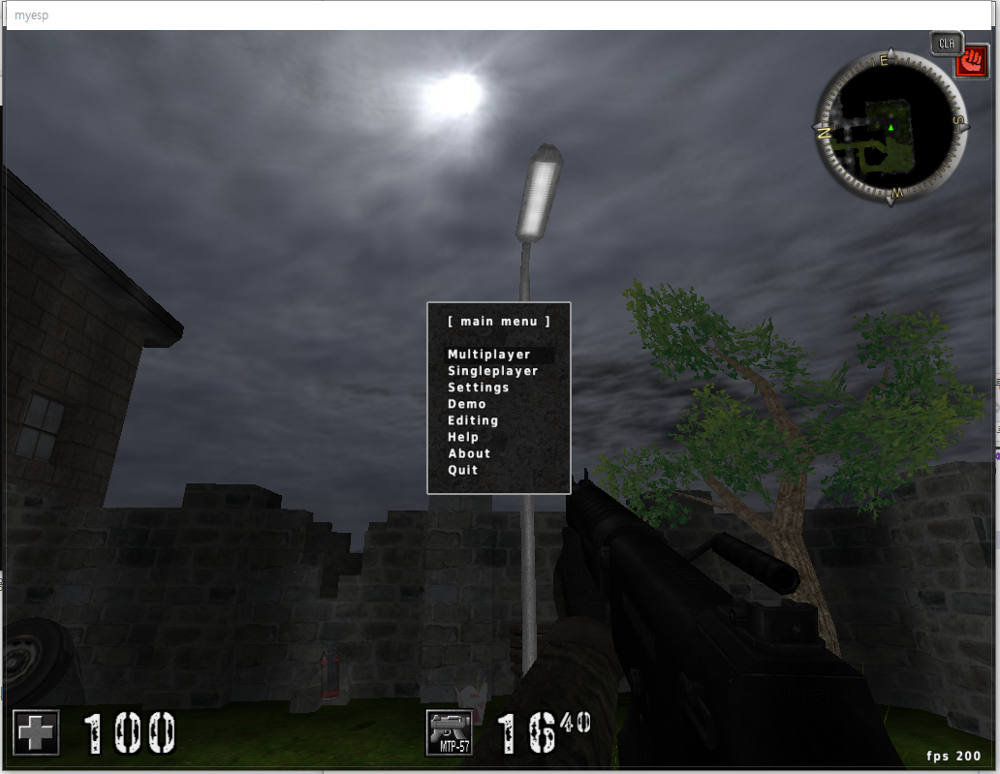

# win32API - Assault Cube ESP : 2. 데이터 표시

게임 내의 데이터들이 어떤 주소에 있을지를 찾아놨으니 이제 그 데이터를 활용해야한다. 

화면에 오버레이를 띄우는 동작은 할 수 있으니, 데이터를 화면에 띄워 적이 어디에 있건 그 위치를 출력할 수있는 동작(월핵)을 구현해보려고 한다. 

이전에 만들었던 지뢰찾기와는 다르게, 어썰트 큐브는 3d +1인칭 게임으로 원하는 대상의 위치를 입체적으로 표현할 수 있어야 한다. 

우선 거리에 상관없이 적 정보를 표시할 수 있는 오버레이를 먼저 띄워보는걸 해보자 

어떤 순서로 해볼거냐면, 

1. assault cube 프로세스에 오버레이를 연결, 화면 크기에 맞게 띄워주고
2. 메모리를 읽어와 화면의 특정 부분에 정보를 표시한다.
3. 적 위치를 화면에 사각형 모양으로 표시한다
4. 에임봇이 작동되면 자동으로 적에게 타겟팅 및 발사된다

우선 1번은 이전에 만든 지뢰찾기 베이스 코드에서 사각형 그리는 부분만 제외하면 바로 가능 가능하니, 해당 코드를 그대로 이용했다. 

---

일단 화면 크기를 정확하게 맞춰주기 위해 SetWindow 함수를 조금 조정했다. 

```cpp
void SetWindow() {
	HWND tWnd;
	RECT tRect;
	RECT wRect;
	int wWidth, wHeight;
	int margin = 5;

	while (true) {
		tWnd = FindWindow(0, TargetName);
		//getTimer();
		if (tWnd) {
			GetWindowRect(tWnd, &tRect);
			wRect.left = tRect.left - margin;
			wRect.top = tRect.top - margin;
			wWidth = tRect.right - wRect.left + margin;
			wHeight = tRect.bottom - wRect.top + margin;
			DWORD dwStyle = GetWindowLong(tWnd, GWL_STYLE);
			MoveWindow(hWnd, wRect.left, wRect.top, wWidth, wHeight, true);
		}
		else {
			exit(1);
		}
	}
}
```

읽어온 가로/세로길이에서 약간의 오차를 보정해주자.

보정 전 



보정 후


오버레이 창의 크기가 딱 맞게 된다. 

이제 메모리를 읽어와 화면에 표시할 건데, 일단 기본적으로 항상 볼 수 있는 정보를 가지고 테스트를 해보겠다. 

게임상에서 볼 수 있는 정보인 체력과 탄환 외 , 현재 캐릭터의 위치 좌표를 오버레이에 띄워보자. 

플레이어 정보를 가져와 저장할 구조체를 하나 선언하고,  구조체가 생성될 때 프로세스의 메모리에서 데이터를 읽어와 자동으로 저장하게끔 생성자를 만들어주자.  메모리 데이터를 읽어오려면 프로세스 핸들이 필요하므로, getPhandle 함수에서 가져온 phandle을 생성시에 인자로 넘겨주면 될듯?

```cpp
class Player {

public:

	char name[20];
	int base;
	int health;
	vec3d_f position;

	Player(HANDLE phandle)
	{
		
	}
};
```

일단 플레이어 구조체의 형태. 생성자에서 해야 할 동작은 phandle을 가져와 대상 프로세스에서 메모리를 읽고 현재 position을 가져오는 것.  일단 플레이어의 베이스 주소를 세팅하고 베이스 주소를 기준으로 다른 값들을 읽어와서 채워주자.

```cpp
Player(HANDLE phandle)
	{
		ReadProcessMemory(phandle, (LPCVOID)player_base, &base, sizeof(base), 0);
		ReadProcessMemory(phandle, (LPCVOID)(base + of_posx), &position.x, sizeof(position.x), 0);
		ReadProcessMemory(phandle, (LPCVOID)(base + of_posy), &position.y, sizeof(position.y), 0);
		ReadProcessMemory(phandle, (LPCVOID)(base + of_posz), &position.z, sizeof(position.z), 0);
		ReadProcessMemory(phandle, (LPCVOID)(base + of_health), &health, sizeof(health), 0);
		ReadProcessMemory(phandle, (LPCVOID)(base + of_name), &name, sizeof(name), 0);
	}
```

```cpp
Player userPlayer(getPhandle());
	printf("user pos x : %f ", userPlayer.position.x);
	printf("user pos y : %f ", userPlayer.position.y);
	printf("user pos z : %f ", userPlayer.position.z);
```

그 다음 메인 프로그램에서 플레이어 구조체를 생성한 다음, 일단은 콘솔에 데이터를 뿌려보는것 부터 테스트 해보면 잘 나오지만, 데이터들이 클래스 생성시에만 들어가고 갱신되지 않는다. 


계속해서 갱신될 수 있게 하려면 클래스 멤버함수로 값을 업데이트해주는 함수를 하나 추가하고, 메인함수에서 항상 루프를 돌며 값이 업데이트 될 수 있도록 지정해줘야 한다. 

일단 그 전에, 화면상 오버레이에 데이터를 먼저 뿌려보자. 


출력까지 잘 되니 이제 실시간 갱신이 되게끔 하면 되는데, 기존처럼 InvalidateRect을 사용하면 갱신되는 글자가 계속 깜빡이는(Flickering) 현상이 발생한다.  이를 처리하려면 더블 버퍼링을 사용해 지워지자마자 다른 Device Context가 화면에 표시되게끔 만들어야 한다.  gdi에서는 기본적으로 이러한 기능을 제공하지 않기에 별도의 작업이 필요하다. 

기왕 이렇게 된거 GDI에 openGL까지 추가하여 작업 계속 진행했다. 

```cpp
솔루션 properties C/C++ – general - additional inlude directories 에 include 디렉토리추가

그다음 linker – general – additional lib 에 lib 디렉토리 추가

이후 linker – input – additional dependencies 에 lib 파일 이름 추가

.dll 없어서 실행 안되면 debug 폴더에 dll 파일 넣거나 system32에 dll 넣기. 

C - 전처리기 - 전처리기 정의 - GLM_ENABLE_EXPERIMENTAL; 추가
```

glm 라이브러리를 다운받고 프로젝트에 위 사항들을 추가해주자. 

openGL에서 내가 사용할 기능은 일단은 화면에 데이터를 랜더해주는 기능만 필요로 하므로 쉐이더나 엠비언트, 텍스쳐 관련 기능은 추가할 필요가 없다. 

이경우엔 win32의 항상 콜백 기능을 사용하는 대신 , WinMain에서 GL의 기능을 사용하는 식으로 변경된다.  또, openGL의 display,timer,reshape 콜백도 사용하지 않는다. 

대신에 조건 분기를 걸어, 메시지가 전달된다면 WinMain의 콜백 기능을 사용하고 , 그렇지 않은 경우엔 GL의 display 콜백과 동일하게 동작하는 함수를 별도로 선언해 사용한다.  그를 위해서 GetMessage 대신 PeekMessage 함수를 사용한다. 

다만 이 프로그램의 경우는 paint message가 계속 전달되므로, paint 콜백 이벤트 위치에 GLUT 동작을 넣어도 무방할듯 싶다.

일단 확장성을 확보해놓고 GDI내의 더블 버퍼링 기능을 사용하려고 했으나, 기술적인 한계로 GDI 상에서 오버레이, 즉 투명 배경을 사용하면서 동시에 더블버퍼링을 하는건 불가능하다는 내용을 찾았다.  플리커를 줄일수는 있으나 없애는건 불가능하다는 듯.

이제와서 다시 openGL로 선회하기는 어렵다. 확장성만 확보해놓고 어느정도의 플리커링은 감수하고 계속 진행하자.  보니까 C++ 기반 ESP들은 어느정도의 플리커링은 감수하고 하는것 같다.  내 경우는 빈도를 줄이는것으로 만족하자. 

화면에 플레이어 데이터 테이블을 읽어와 다른 유저들의 정보를 벽 너머에서도 확인할 수 있는, 월핵을 본격적으로 만들어보자. 

일단 다른유저의 정보를 받아와야 한다. 

```cpp
Player(HANDLE arghandle, int pidx)//플레이어 외 적의 경우 
	{
		pidx += 1;
		phandle = arghandle;
		ReadProcessMemory(phandle, (LPCVOID)entity_base, &tbase, sizeof(tbase), 0);
		ReadProcessMemory(phandle, (LPCVOID) (tbase + (int)(pidx*4)), &base, sizeof(base), 0);
		ReadProcessMemory(phandle, (LPCVOID)(base + of_posx), &position.x, sizeof(position.x), 0);
		ReadProcessMemory(phandle, (LPCVOID)(base + of_posy), &position.y, sizeof(position.y), 0);
		ReadProcessMemory(phandle, (LPCVOID)(base + of_posz), &position.z, sizeof(position.z), 0);
		ReadProcessMemory(phandle, (LPCVOID)(base + of_health), &health, sizeof(health), 0);
		ReadProcessMemory(phandle, (LPCVOID)(base + of_name), &name, sizeof(name), 0);
	}
```

Player 구조체에 오버라이딩해서, 생성자에 인덱스를 같이 넘기는 경우엔 봇 정보를 받아오는것으로 하자.  


제대로 찾아서 넘어오는게 확인된다. 이제 저렇게 가져온 좌표 정보를 화면상에 사각형으로 띄울 수 있게 만들어야 한다. 

게임은 3d공간으로 구성되어 있는데, 내가 화면을 뿌려줄 곳은 2d 공간이다. 따라서 내 현재 위치와 각도를 기준으로 상대방의 좌표가 어디에 있을지를 찾아서 계산하고 출력해야한다. 

현재 내가 보고있는 각도를 알 수 있으므로, 내위치와 상대위치를 통해 각도를 계산하고, 현재 내가 보고있는 각도 범위와 이를 비교하여 화면에 출력해야한다.  

또, 상대방과의 거리도 감안하여 거리에 따라 화면에 보이는 상대방의 크기가 달라져야 한다.

와 이걸 어떻게 하지? 수학적 소양이 필요해졌다.  순차적으로 정리해보면

1. 각 플레이어의 절대 좌표를 기준으로 하여 목표와의 상대적인 각도(x축 y축 각각)를 구해야함
2. 지금 화면에 들어온 각도 범위에 해당 각도가 들어오는지 판정할 수 있어야함 - 이는 카메라 viewpoint 시야각에 대한 계산도 필요할듯- 시야각 내에 적이 존재한다면 사각형을 그려서 표시해야한다. 
3. 사각형의 위치는 자신과 상대의 좌표를 기준으로 계산한 각도와 현재 플레이어가 바라보고 있는 방향의 각도를 사용해 계산하여 표시해야한다. 
4. 사각형의 크기는 자신과 상대의 좌표를 기준으로 거리를 계산하여 그에 맞게 줄어지고 커져야함. 

순서대로 하나씩 해보자. 

---