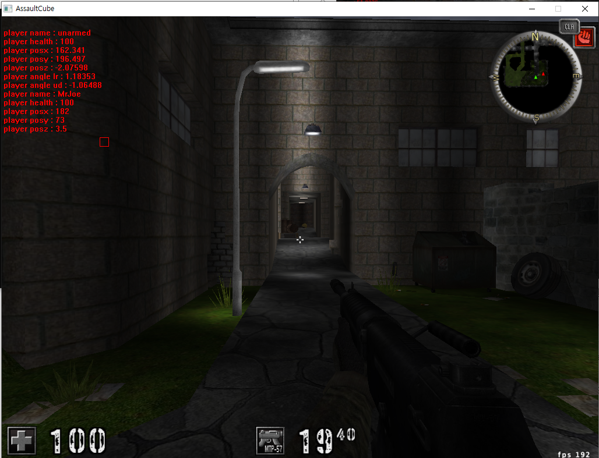

# win32API - Assault Cube ESP 좌표계 계산

대략적으로 정한 순서 

1. 각 플레이어의 절대 좌표를 기준으로 하여 목표와의 상대적인 각도(x축 y축 각각)를 구해야함
2. 지금 화면에 들어온 각도 범위에 해당 각도가 들어오는지 판정할 수 있어야함 - 이는 카메라 viewpoint 시야각에 대한 계산도 필요할듯- 시야각 내에 적이 존재한다면 사각형을 그려서 표시해야한다. 
3. 사각형의 위치는 자신과 상대의 좌표를 기준으로 계산한 각도와 현재 플레이어가 바라보고 있는 방향의 각도를 사용해 계산하여 표시해야한다. 
4. 사각형의 크기는 자신과 상대의 좌표를 기준으로 거리를 계산하여 그에 맞게 줄어지고 커져야함. 

### 좌표를 기준으로 각도찾기



화면상에서 N 방향을 볼 때 X축 각도(lr angle)이 0도가 되고,  상하 각도(Y)는 수평을 기준으로 90~-90까지 이어진다. 

먼저 z좌표를 무시하고, 상대와 내 x,y 좌표만 가지고 각도를 계산하고, 실제 플레이어가 바라보는 각도와 일치하는지를 확인할 수 있어야 한다. 

이걸 계산할라면 삼각함수가 필요한데, 


대충 저 세타값이 필요하다.  나와 상대의 x좌표상 거리와 y좌표상 거리는 알고 있으니, 탄젠트 함수를 이용하면 값이 구해지겠다. Winapi에서 탄젠트 함수를 사용하자. 

```cpp
double res;
	res = atan2(userPlayer.position.y - otherPlayer[0].position.y,
		userPlayer.position.x - otherPlayer[0].position.x) * 180 / PI;
```


각도가 잘 구해진다. 여기서 좌표계상 각도와 시점상 각도만 계산해서 맞춰주면 나를 기준으로 몇도로 앵글을 돌려야 적이 존재하는지를 구할 수 있게 된다. 


지금 angle에 표시된 217 위치로 각도를 돌리면 적이 존재한다는 의미이고, 실제로도 l-r 각도와 계산 결과 각도가 동일하게 잘 나오는게 확인된다.

같은방식으로 ud 각도도 맞춰주자. 이경우는 상/하 각도가 필요하니까 x,y의 대각선 거리도 계산해서 넣어주는 과정이 필요하다. 

```cpp
dist = sqrt(powf(userPlayer.position.x - otherPlayer[0].position.x,2) +
		powf(userPlayer.position.y - otherPlayer[0].position.y,2));

	res2 = atan2(userPlayer.position.z - otherPlayer[0].position.z,
		dist) * 180 / PI;
	res2 = res2 * -1;
```


상하 각도도 구해졌다.  현재까지 나온 결과를 보면, 북쪽을 기준으로 플레이어 좌 우는 270~ 90까지, 상하는 90~-90까지 기준값을 정할 수 있었다. 

이제 플레이어가 현재 바라보는 각도와 실제 적의 각도간 차이를 이용해 화면상 어떤 위치에 그림을 그릴지를 계산해야 한다. 

기본적인 생각은 이렇다. 

1. 현재 내 캐릭터로부터 적을 가리키는 방향이 249 일때, 내가 맵 어디에 있건 내 위치로부터 249방향 + 나로부터 적까지의 거리 위치에는 해당 적이 있을거다.  
2. 따라서, 현재 내가 보는 방향을 기준으로 하여 적 방향을 가리키는 점을 찍어야 하는데, 이때 내가 보는 위치에서 적 위치까지 각도와 거리를 이용해 상대적인 위치를 구해야 하므로, 이를 화면에 매핑하는 작업이 필요하다. 
3. 화면의 가로/세로 길이를 구한다음, 적을 가리키는 방향이 현재 내가 보는 화면상에서 표현할 수 있는 위치인지를 먼저 체크하고, 표현할 수 있는 방향이라면 값을 계산해 화면상 특정 픽셀 위치에 점을 찍어줘야 할것이다. 

일단 y축은 고정하고, x축 방향에서만 표현이 가능한지 해볼건데, 내가 보는 방향에서 좌/우 최대 시야각은 각각 약 40도 정도로 계산이 되므로, 실제 적의각도와 내가 보는 방향의 각도값의 차가 40이 넘으면 화면에 적 위치가 뜰수없다. 

일단 대략적인 각도 말고 실제 각도를 구해보니 실제 각도는 45도정도가 나왔다. 최대 시야각은 90도라는 소리. 

화면의 가로 길이를 최대 시야각으로 나눈 다음, 화면의 중심을 기준으로 내 시선과 적 방향의 각도차를 구한 값을 화면상에 매핑해주면  화면 어디위치에 적이 있는지가 나올것이다. 

이때, 적이 내 시선의 우측에 있는지, 좌측에 있는지 정도는 구분해서 화면상에 보여줄 수 있어야된다. 


어느정도 비슷하게는 나오는데 정확하게는 못찍는다. 아마 화면 시야각때문에 그럴듯.  같은 방식으로 lr 뿐 아니라 ud 각도까지 계산해서 넣어주면 화면상에서 보다 정확한 위치를 찍을듯하다. 


벽 너머에서도 정확하게 위치를 찾아올 수 있는게 보인다.  이정도만 되면 어느정도의 ESP 는 된셈. 

```cpp
lrabs = fabs(lrA - userPlayer.screen.x);
	udabs = fabs(udA - userPlayer.screen.y);

	buffer << "lrabs : " << lrabs;
	TextOutA(hDC, x, y, buffer.str().c_str(), strlen(buffer.str().c_str()));
	y += 15;
	buffer = {};
	
	if (lrabs <= 45.0) {
		rect.left = ( (lrA- userPlayer.screen.x) * gWidth/92 ) + gWidth/2;
		rect.top = ((userPlayer.screen.y-udA) * gHeight / 92) + gHeight / 2;
		rect.right = rect.left + 15;
		rect.bottom = rect.top + 15;
		FrameRect(hDC, &rect, redBrush);
		
	}
```

이제 모든 적에 대응해 거리 계산해서 가로/세로 길이 맞춰주는 작업이 남아있다. 


약간의 오차는 나지만 그래도 모든 캐릭터에 대응은 된다. 

대충 월핵이 완성되었다. 캐릭터의 테두리를 네모낳게 딱 맞춰주는 작업도 필요할것 같지만, 내가 실제 핵을 만드는게 목적이 아니고, 리버싱을 통한 메모리 릭과 프로그래밍이 목적이었으므로 여기까지만.