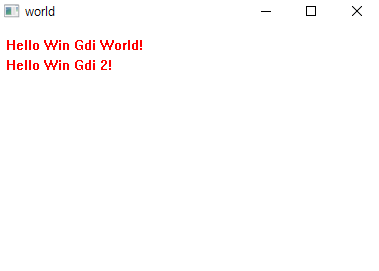
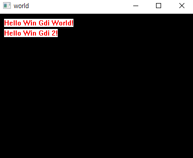
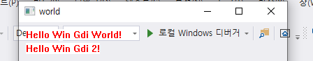
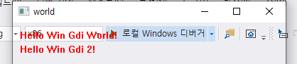
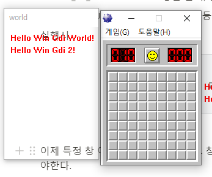
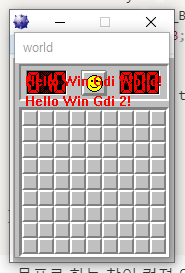
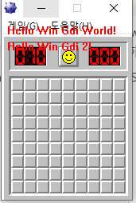

# Win32API - GDI

GDI(Graphics Device Interface) : 윈도우에서 그래픽 작업 처리를 위해 제공하는 기본 graphic API 

```cpp
case WM_PAINT: {
		RECT rect;
		RECT rect2;
		PAINTSTRUCT ps;
		HDC hdc = BeginPaint(hWnd, &ps);
		SetTextColor(hdc, RGB(0xFF, 0x00, 0x00));
		rect.left = 10;
		rect.top = 10;
		rect2.left = 10;
		rect2.top = 30;
		DrawText(hdc, L"Hello Win Gdi World!", -1, &rect, DT_SINGLELINE | DT_NOCLIP);
		DrawText(hdc, L"Hello Win Gdi 2!", -1, &rect2, DT_SINGLELINE | DT_NOCLIP);
		EndPaint(hWnd, &ps);
		break;
	}
```

콜백함수에 위 내용을 추가해 주었다. 

- HDC(Handle to Device Context) : Device Context의 핸들을 지정한다.
    - BeginPaint 함수 : hWnd과 PAINTSTRUCT을 인자로 device Context 핸들을 반환한다.
    - PAINTSTRUCT : 해당 구조체는 painting 동작에 대한 정보를 가지고 있는 구조체.
    
- SetTextColor : hdc와 색상 코드를 인자로 하여 실행되며, 해당 핸들을 사용하는 함수들의 텍스트 색상을 변경하는 역할을 한다.

- DrawText 함수 : 이름 그대로 텍스트를 그리는 동작을 한다.
    - 세번째 인자는 문자열의 길이를 지정하는데, -1이 넘어갈 경우 마지막 null 문자까지 포함하여 자동으로 길이를 계산한다.
    - 네번째 인자로 넘어갈 건 사각형 RECT 구조체의 포인터. 중요한건 아니다.
        - rect 구조체의 가로-세로 좌표를 각각 지정해 줄 수 있다.
    - 다섯번째 인자로 플래그 옵션을 지정할 수 있다.
        - DT_SINGLELINE : 모든 텍스트를 한줄로 출력
        - DT_NOCLIP : 화면 밖을 벗어나는 텍스트도 출력함. - 이 플래그가 지정되면 함수 동작이 약간 더 빨라진다.
    - EndPaint는 Beginpaint가 붙들어놨던 device context를 할당 해제하는 역할을 한다. 해제 전까지는 해당 hdc를 사용하는 다른 동작이 불가능할것 같지만, 꼭 그런건 아닌듯.

    실행시

    

    - case WM_CLOSE 추가해서 PostQuitMessage(0) 안해주면 백그라운드에서 프로세스가 계속 도므로 꼭 추가하자.

    

    

    이제 화면위에 올릴 overlay를 구현해야 한다. 

    배경을 검정색으로 바꾼 다음 , 검정색을 투명으로 변경하는 함수를 사용하여 투명 오버레이를 구현하자. 

    ```cpp
    c.hbrBackground = (HBRUSH)CreateSolidBrush(RGB(0, 0, 0));
    ```

    실행시

    

    WinMain에서 hWnd 생성 후에 다음 코드를 추가해준다.

    ```cpp
    SetWindowLong(hWnd, GWL_EXSTYLE, GetWindowLong(hWnd, GWL_EXSTYLE) ^ WS_EX_LAYERED);
    SetLayeredWindowAttributes(hWnd, RGB(0, 0, 0),0 , LWA_COLORKEY);
    ```

    SetWindowLong 함수는 윈도우(창)의 설정을 변경하거나 정보를 저장할때 사용하고, 

    SetLayeredWindowAttributes 함수는 특정 색의 투명도를 조절하는 (크로마키처럼?) 함수이다. 

    - LWA_ALPHA 와 LWA_COLORKEY 플래그 중 선택해서 쓸 수 있는데, 2번쨰 인자가 색상, 세번쨰 인자가 불투명도를 조절한다. 이때 LWA_ALPHA 만 사용하면 화면 위 상태창과 글자까지 전부 투명화 되어 안보이니까 COLORKEY를 사용하자.

    

    투명화가 잘 되는데, 테투리랑 창 배경, 글자 배경색이 거슬린다.  WM_PAINT case에 아래 코드 추가한다.

    ```cpp
    SetBkMode(hdc, TRANSPARENT);
    ```

    hdc 핸들의 배경색을 투명으로 변경하면 글자색도 투명하게 바뀐다. 

    

    그 다음, CreateWindowW 함수를 CreateWindowEx로 변경 할 건데, 첫번째 인자로 WS_EX_TOPMOST | WS_EX_TRANSPARENT를 추가하고 , 네 번쨰(이전의 세번쨰 - S_OVERLAPPEDWINDOW) 인자를 WS_POPUP으로 교체 해줄거다. 

    ```cpp
    HWND hWnd = CreateWindowEx(WS_EX_TOPMOST | WS_EX_TRANSPARENT, szClassName, L"world",
    		WS_POPUP, 100, 90, 400, 350, NULL, NULL, hInstance, NULL);
    ```

    - WS_EX_TOPMOST  : 창이 항상 맨 위에 떠있게 하는 플래그
    - WS_EX_TRANSPARENT : 창을 클릭, 선택할 수 없게 하는 플래그
    - WS_POPUP : 창의 버튼들, 테두리 등을 없애는 옵션

    실행시

    

    이제 특정 창 이름을 기준으로 하여 그 창위 크기에 맞게 오버레이가 뜨고, 창을 따라가게끔 만들어야한다. 

    테스트로 사용할 건 지뢰찾기 (옛날버전) . 

    창 정보에서는 이름이 "지뢰찾기" 로 뜨고, 작업관리자에서는 "Entertainment Pack Minesweeper Game" 으로 뜨는데 뭐가 진짠지 모르겠어서 일단 창정보에 뜨는 이름으로 진행한다. 

    창을 찾아서 가로 , 세로 길이를 해당 창과 똑같게 만들게끔 하자. 

    ```cpp
    tWnd = FindWindow(0, TargetName);
    GetWindowRect(tWnd, &tRect);
    wWidth = tRect.right - tRect.left;
    wHeight = tRect.bottom - tRect.top;
    if (!tWnd) {
    	wWidth = 400;
    	wHeight = 350;
    }
    ```

    창 이름을 기준으로 창을 찾아와 핸들을 생성하고, 해당 창의 가로/세로 길이를 가져와 tSize RECT에 저장한다. 

    이후 창 생성시 시에 찾아온 Rect의 가로,세로 길이를 가지고 오버레이를 만들어보자 

    

    창 이름으로 찾기가 된거같..은데 뭔가 미묘하게 크기가 다르다. 뭐지 

    일단 길이는 됐으니까 이제 찾아오게 해야하는데,  해당 동작을 하는 함수를 별도로 생성한 다음, 쓰레드를 별도로 만들어 함수를 실행하게끔 해주자. 

    ```cpp
    void SetWindow(HWND hwnd) {
    	HWND tWnd;
    	RECT tRect;
    	int wWidth, wHeight;
    
    	while(true){
    		tWnd = FindWindow(0, TargetName);
    		if (tWnd) {
    			GetWindowRect(tWnd, &tRect);
    			wWidth = tRect.right - tRect.left;
    			wHeight = tRect.bottom - tRect.top;
    			DWORD dwStyle = GetWindowLong(tWnd, GWL_STYLE);
    			if (dwStyle & WS_BORDER) {
    				tRect.top += 23;
    				wHeight -= 23;
    			}
    			MoveWindow(hwnd, tRect.left, tRect.top, wWidth, wHeight, true);
    		}
    		else {
    			exit(1);
    		}
    	}
    }
    ```

    - 목표로 하는 창이 켜져 있다면 while문이 계속 반복 돌면서 창의 위치를 받아오고, 오버레이의 위치를 해당창에 맞게 계속 조정하는 함수이다.
    - GetWindowLong 함수로 GWL_STYLE을 가져와 WS_BORDER 속성이 있으면 목표 창의 세로 길이를 조정하는 부분이 필요하다.

    이제 생성한 함수를 쓰레드로 넘겨서 실행해주자

    ```cpp
    CreateThread(0, 0, (LPTHREAD_START_ROUTINE)SetWindow, hWnd, 0, 0);
    ```

    

    잘 따라온다. 이제 오버레이 속성을 다 조정하면 

    

    굳. 지금은 지뢰찾기 창을 끄면 같이 꺼진다. 

    이제 목표는 지뢰찾기 내부 메모리를 분석하여, 지뢰 위치로 추정되는 칸에 네모를 그리게 하는것.