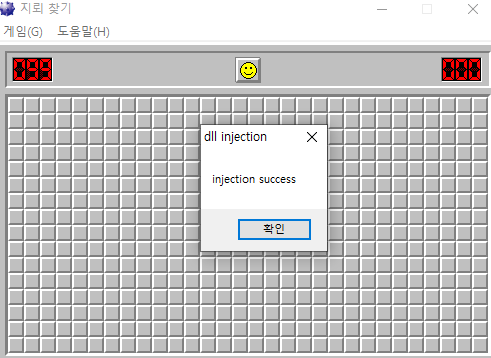

# DLL Injection : 1. 인젝션 실습

Assault Cube용 핵을 제작하기 위해서 DLL 인젝션을 해야하는데, 게임에 바로 적용해보기 전에 일단 어떤식으로 코드가 동작하는지 실습해본다.

대상은 예전에 쓰던 지뢰찾기 게임. 정상 프로세스에 내가 만든 DLL을 인젝션하고, DLL이 인젝션되면 메시지 박스가 뜨게끔 해보자. 

진행시에는 백신을 끄고 진행해야한다. dll 인젝션 기능은 바이러스에서도 많이 사용하기에 악성코드로 인식하더라. 

```cpp
#include <Windows.h>
#include <TlHelp32.h>
#include <string>
#include <tchar.h>
//프로세스 이름을 인자로 하여 pid를 반환하는 함수 
bool process_name_to_pid(
	__out DWORD& pid,
	__in const std::wstring& process_name
);
//해당 PID를 가진 프로세스에 지정한 이름을 가진 dll을 인젝션함. 
bool dll_injection(
	__in DWORD pid,
	__in const std::wstring& dll_name
);
int main()
{
	DWORD pid = 0;
	std::wstring process_name = L"winmine_(한글).exe";
	std::wstring dll_name = L"G:\\dll_injection\\testDll1.dll";
	//프로세스 이름을 통해 pid를 구해오고, 해당 pid에 지정한 이름을 가진 dll을 인젝션 하는 동작. 
	if (process_name_to_pid(pid, process_name)) {
		dll_injection(pid, dll_name);
	}
	return 0;
}
bool process_name_to_pid(
	__out DWORD& pid,
	__in const std::wstring& process_name
) {
	bool result = false; //결과는 기본적으로 false, 프로세스가 존재할 경우 true로 설정.  
	HANDLE snapshot = nullptr;
	PROCESSENTRY32 entry = {};
	entry.dwSize = sizeof(PROCESSENTRY32);

	snapshot = CreateToolhelp32Snapshot(TH32CS_SNAPALL, 0);
	//지정된 프로세스의 힙, 모듈에대한 스레드 정보 스냅샷을 가져오는 함수. 
	
	if (snapshot != INVALID_HANDLE_VALUE) {
		//do-while 문 안에서 프로세스 목록을 탐색하며 사용자가 지정한 프로세스 이름이 있는지 탐색한다.
		Process32First(snapshot, &entry);
		// 스냅샷에서 발생한 첫번쨰 프로세스 정보를 검색 
		do {
			if (!_tcsicmp(process_name.c_str(), entry.szExeFile)) {
				//지정한 프로세스 이름과 entry의 프로세스 이름이 일치(_tcsicmp함수-대소문자 구분X) 하는지 비교. 
				pid = entry.th32ProcessID;
				result = true;
				break;
			//일치하는 경우에 result 변경 및 pid 반환. 
			}
		} while (Process32Next(snapshot, &entry)); //스냅샷에 기록된 다음 프로세스의 정보를 탐색 
		CloseHandle(snapshot);
	}
	return result;
}
bool dll_injection(
	__in DWORD pid,
	__in const std::wstring& dll_name
) {
	bool result = false;
	HANDLE process_handle = nullptr;
	HANDLE thread_handle = nullptr;
	LPVOID remote_buffer = nullptr;
	HMODULE module = {};
	LPTHREAD_START_ROUTINE thread_start_routine = nullptr;
	do {
		process_handle = OpenProcess(PROCESS_ALL_ACCESS, FALSE, pid);
		//해당 PID를 가진 프로세스를 열어 핸들을 가져온다
		if (process_handle == nullptr) {
			break;
		}
		remote_buffer = VirtualAllocEx(
			process_handle,
			nullptr,
			dll_name.size(),
			MEM_COMMIT,
			PAGE_READWRITE
		);
		//해당 프로세스의 가상 메모리 공간에 메모리를 할당함. 
		if (!remote_buffer) {
			break;
		}
		if (!WriteProcessMemory(
			process_handle,
			remote_buffer,
			dll_name.c_str(),
			dll_name.size() * sizeof(wchar_t),
			nullptr)
		) {break;}
		// remote_buffer에 담긴 할당된 메모리 공간에 로드될 DLL의 경로 스트링을 wrtie 한다. 
		module = GetModuleHandle(L"kernel32.dll");
		//kernel32.dll 모듈의 핸들을 가져옴
		thread_start_routine = (LPTHREAD_START_ROUTINE)GetProcAddress(module, "LoadLibraryW");
		//모듈에 담긴 Kernel32.dll 내의 LoadLibrary함수 포인터를 가져와 저장한다. 
		thread_handle = CreateRemoteThread(
			process_handle,
			nullptr,
			0,
			thread_start_routine,
			remote_buffer,
			0,
			nullptr
		);
		//LoadLibrary 함수와 원형이 같은 CreateRemoteThread함수를 이용하여 Thread를 실행하는것 처럼 해당 함수를 실행함.
		//이때 remote_buffer 메모리 공간에는 지정했던 dll의 경로 문자열이 담겨있다.
		//따라서 LoadLibrary 함수를 통해 내가 지정한 dll을 load할 수 있게 되는것. 
		WaitForSingleObject(thread_handle, INFINITE);
		result = true;
	} while (false);
	CloseHandle(process_handle);
	CloseHandle(thread_handle);
	return result;
}
```

```cpp
// dllmain.cpp : DLL 애플리케이션의 진입점을 정의합니다.
#include "pch.h"

BOOL APIENTRY DllMain( HMODULE hModule,
                       DWORD  ul_reason_for_call,
                       LPVOID lpReserved
                     )
{
    switch (ul_reason_for_call)
    {
    case DLL_PROCESS_ATTACH: {
        MessageBox(nullptr, L"injection success", L"dll injection", MB_OK);
    }
    case DLL_THREAD_ATTACH:
    case DLL_THREAD_DETACH:
    case DLL_PROCESS_DETACH:
        break;
    }
    return TRUE;
}
```

프로세스 이름은 process explorer에 뜨는것과 동일하게 적어줌.



잘 작동한다. 

테스트가 잘 되는걸 확인했으니, 시나리오를 정해서 동작을 만들어보자. 

적용해볼 시나리오는 두가지

1. 게임의 타이머 고정
2. 지뢰 드러나는 이벤트 발생해서 지뢰 모습이 보이게

각 시나리오별로 해봐야 하는 작업은

1. 지뢰찾기 실행 후 디버거 attach 하여 실행할 함수 심볼 찾아오기
2. 찾아온 심볼 바탕으로 코드 작성하기 

일단 1번부터 차근차근 해보자.