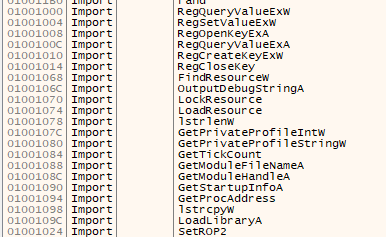

# DLL Injection : 2. 코드 후킹

해볼 시나리오는 2개였다. 

1. 타이머 0초로 고정하기
2. 게임 시작하자마자 지뢰 위치 전부 보여주기 

우선 지뢰찾기에 디버거를 연결한 후 심볼을 보면, 몇몇 함수들의 심볼이 남아있는것 처럼 보인다. 



그러나 대부분의 함수들이 라이브러리 표준 함수로, 게임 내에서 자체적으로 사용하는 함수중엔 심볼이 남아있는게 없는모양. 

따라서 직접 함수를 찾아가야 한다.  치트엔진을 이용해 타이머 값과 연관되는 메모리-프로그램 주소를 찾아가보자. 


위에서부터 순서대로 타이머 동작 → 타이머 1씩 증가 → 타이머 정지 순이다.  마지막 경우에는 edi에 0이 들어있어서 타이머가 0으로 바뀌는듯. 

코드를 패치해서 타이머를 0으로 고정하려면, 몇가지 방법을 생각해볼 수 있다. 

1. inc 명령어 자체를 mov 0 으로 변경해 항상 0을 넣게 하기 
2. inc 구문에서 jmp를 걸어 mov 0 명령어로 점프하게 하기 
3. inc 구문 전체를 nop으로 덮어씌우기

2의 경우는 이미 존재하는 코드 루틴을 사용하는 방법이긴 한데, 어떤식으로 꼬일지 모르니 1이나 3을 시도해보자 .


해당 명령어 위-아래로 저런식으로 구성되는데,  단순히 mov [0100579C],0 어셈으로 바꾸면 어떻게 될까?


오, 증가구문이 사라져 시간이 1로 고정된다.  실제로 게임을 마치면 기록은 어떻게 남을까? 


실제 기록에도 반영이 된다. 

이번엔 전부 nop 코드로 덮어버리면 어떻게 되나.


마찬가지로 시간은 정지되고,


이번엔 타이머 시작시 1 올라가는 명령어의 영향을 받았기에 기록은 1초가 된다. 

이제 두 방법 모두를 dll 인젝션을 이용해 코드 패치를 해보자. 

일단 재시작했을 때 명령어의 주소값이 바뀌는지부터 확인을 해보면 


코드주소는 정적인듯. cpp에서도 동일한 주소영역에 대해 패치 진행해보자. 

인젝터 프로그램은 그대로 두고, dll만 내용을 추가한다.  nop 패치보다는 0을 mov하는게 더 깔끔한 방식인듯. 

코드 후킹시에는 해당 메모리 영역, 즉 코드 영역에 write권한이 존재할때만 코드패치가 가능한데, 대부분의 경우에는 권한이 부여되어있지 않다. 

따라서 dll 코드상에서 VirtualProtect 함수를 실행하여 write 권한을 부여해줘야 코드패치가 가능해진다. 

```cpp
// dllmain.cpp : DLL 애플리케이션의 진입점을 정의합니다.
#include "pch.h"
#include "windows.h"

DWORD WINAPI patch(LPVOID lParam) {
    LPVOID TargetAddr = (LPVOID)0x0100579C;
    DWORD Protect = 0;

    VirtualProtect(TargetAddr, 0xB, PAGE_READWRITE, &Protect);
    // 0x0100579C 주소 영역에서 총 11바이트 만큼 공간에 write 권한을 부여함. 
    // ------- asm ------
    // mov 0100579c,00000000
    // nop 
    // ------- hex -----
    // C7 05 9C 57 00 01 00 00 00 00 
    // 90 
    *((LPBYTE)TargetAddr + 0) = 0xC7;
    *((LPBYTE)TargetAddr + 1) = 0x05;

    *((LPBYTE)TargetAddr + 2) = 0x9C;
    *((LPBYTE)TargetAddr + 3) = 0x57;
    *((LPBYTE)TargetAddr + 4) = 0x00;
    *((LPBYTE)TargetAddr + 5) = 0x01;

    *((LPBYTE)TargetAddr + 6) = 0x00;
    *((LPBYTE)TargetAddr + 7) = 0x00;
    *((LPBYTE)TargetAddr + 8) = 0x00;
    *((LPBYTE)TargetAddr + 9) = 0x00;

    *((LPBYTE)TargetAddr + 10) = 0x90;
    return 0;
}

BOOL APIENTRY DllMain( HMODULE hModule,
                       DWORD  ul_reason_for_call,
                       LPVOID lpReserved
                     )
{
    HANDLE hThread = NULL;
    switch (ul_reason_for_call)
    {    
    case DLL_PROCESS_ATTACH:
        hThread = CreateThread(NULL, 0, patch, NULL, 0, NULL);
        CloseHandle(hThread);
    case DLL_THREAD_ATTACH:
    case DLL_THREAD_DETACH:
    case DLL_PROCESS_DETACH:
        break;
    }
    return TRUE;
}
```

실행될 함수를 정의하고, 코드 영역 한바이트 씩 패치를 진행한다. 

정의한 함수를 실행할 때는 CreateThread 함수를 이용해 새로운 쓰레드를 생성하여 실행하는 식으로 동작한다. 

코드 빌드 후 인젝션 exe 를 실행하면 디버거상 심볼에서 해당 dll이 로드된게 확인된다. 


디버거의 어셈상에서는 패치된 명령어가 보이지는 않지만, 게임을 시작해보면 타이머가 고정되는게 보인다. 


코드 후킹을 이용한 타이머 고정 성공