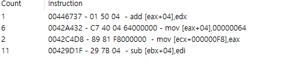

# DLL injection : 3. Assualt Cube

이젠 이전에 월핵을 만들어봤던 어썰트 큐브에다 코드 패치를 적용해보자. 

만들 기능은 플레이어가 피격당하더라도 체력이 감소하지 않게 만들기. 

플레이어의 체력감소 이벤트 코드 구문을 찾아가야한다. 



맨 아래쪽이 플레이어 피격 발생시 체력 감소 구문이다. 무기 종류에 관계 없이 피격 발생시엔 해당 코드가 동작한다. 

sub를 add로 바꿔보자. 


피격 발생시 체력이 올라가는게 보인다. 근데 그렇게 하면 나만 체력이 올라가는게 아니고, 모든 피격 이벤트에 대응하여 모든 캐릭터의 체력이 증가하게 된다 .

즉, 멀티플레이어 게임에서 코드 구문 변경으로 동작을 변경하는 방식은 썩 좋은 형태는 아니란 소리 . 메모리 값에 직접 접근해야할듯 싶다. 

다른 사람들이 만들었던 핵을 보니, 코드 패치보다는 게임 인스턴스에 직접 접근하여 값을 변경하는 식으로 동작한다. 이 방식 또한 DLL 인젝션은 필요하다. 

이전에 만들어둔 인젝터 코드에서 프로세스 이름을 바꿔주고, dll 코드를 새로 작성해보자. 

일단 인젝션된 dll이 프로세스 메모리로부터 값을 바로 가져올 수 있게 해야한다. 

```cpp
DWORD WINAPI patch(LPVOID lParam){
    FILE* pFile = nullptr;
    int * playerbase = (int*) 0x0050F4F4; 
    int health_offset = 0xf8; 
    int * health = (int*) (( *playerbase) + health_offset);
    if (AllocConsole()) {
        freopen_s(&pFile,"CONIN$", "rb", stdin);
        freopen_s(&pFile, "CONOUT$", "wb", stdout);
        freopen_s(&pFile, "CONOUT$", "wb", stderr);
        //cout << "injection success" << endl;
        printf("injection success\n");
        printf("base : %08x \n", playerbase);
        printf("base : %08x \n", * playerbase);
        printf("base : %08x \n", health );
        printf("health : %08x \n", *health);
        //printf("health : %08x \n", );
        
    }
    //MessageBox(nullptr, L"injection success", L"dll injection", MB_OK);

    return 0;
}
```


플레이어 베이스 주소 → 에서 가져온 주소 +F8 → 위치에 체력 값 존재

의 형태이므로, 포인터를 참조하여 주소를 가져오고, 연산을 진행한 다음 한번 더 포인터 참조를 해야 한다.

체력이 100 미만으로 내려갔을때 다시 100으로 회복하는 코드를 dll에 추가하고 실행해보면


```cpp
DWORD WINAPI patch(LPVOID lParam){
    FILE* pFile = nullptr;
    int * playerbase = (int*) 0x0050F4F4; 
    int health_offset = 0xf8; 
    health = (int*) (( *playerbase) + health_offset);
    if (AllocConsole()) {
        freopen_s(&pFile,"CONIN$", "rb", stdin);
        freopen_s(&pFile, "CONOUT$", "wb", stdout);
        freopen_s(&pFile, "CONOUT$", "wb", stderr);
        //cout << "injection success" << endl;
        printf("injection success\n");
        printf("base : %08x \n", playerbase);
        printf("base : %08x \n", * playerbase);
        printf("base : %08x \n", health );
        printf("health : %08x \n", *health);
        while (1) {
            if (*health < 100)
            {
                printf("low health");
                *health = 100;
            }
        }
    }
    //MessageBox(nullptr, L"injection success", L"dll injection", MB_OK);

    return 0;
}
```

while 문을 이용하는게 스무스한 방식은 아닌것 같지만, 폭탄맞고 죽지만 않으면 (즉사판정) 피격 당하더라도 체력이 항상 100으로 유지되고, 적에게는 정상적으로 데미지가 들어가는게 확인된다. 

복잡한 방법 없이 프로세스에 인젝션된 dll을 통해 메모리 값 변조까지 진행해봤다.