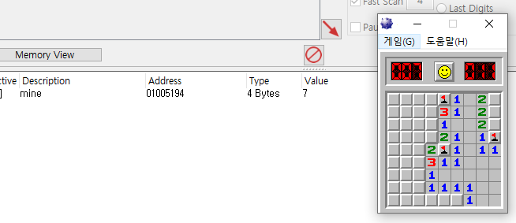

# Win32 API - 지뢰 찾기

지뢰 위치를 찾기 위해, 메모리를 분석해 지뢰의 메모리 상 위치를 찾아보자. 



치트엔진에서 지뢰를 찾고, 남은 지뢰 갯수를 카운트하는 변수가 저장된 메모리 주변을 찾아 지뢰가 어디에 있는지, 메모리 구조는 어떻게 되어 있는지 확인해보자. 


닫힌칸은 0F로 표시되고, 열린칸은 해당 칸의 숫자로 표시된다. 40은 0이니까 빈 칸을 나타내는  듯.  그럼 8F로 표시된게 지뢰인가?

1바이트당 한칸을 배정해 연달아서 이어지고 있고, 한 줄의 시작점부터 다른 줄의 시작 점 까지는 0x20, 32바이트만큼 차이가 난다. 9*9인데도 그렇게 배정한 걸 보면 더 큰 크기일때를 고려하여 이렇게 한듯. 

사용자 지정 옵션을 하더라도 최대 길이는 30 까지밖에 안되고, 각 줄의 시작과 끝에는 0x10이 들어가 있다. 

01005361 주소부터 시작해서 난이도에 따른 너비 길이의 끝까지 들어가고, 다음줄까지는 0x20만큼 차이가 나는것 까지 날아냈다. 

혹시 가로/세로 길이도 찾을 수 있을까? 


가로/세로 길이를 바꿔가면서 해보니 추정되는 위치는 나왔는데, 저 중 하나는 아마 변경한 값 자체를 갖고있는 변수일 것이다. 어찌됐든 동일한 값을 가질테니 지뢰 정보를 담고있는 메모리 영역에서 가장 가까운 영역을 지정하자. 

- 지뢰 정보 시작 메모리 01005361
- 세로 길이정보 01005338 , 가로 길이정보 01005334
- 타이머 변수 0100579C

이제 오버레이에서 메모리 정보를 가져와 지뢰를 판정하면 된다.  

구상을 해보자. 게임을 시작 할 때 가로/세로 길이정보를 가져와서 2차원 배열을 생성하고, 게임이 시작되었는지 여부는 타이머 변수가 0이 되는지로 판단하면 될듯. 

우선 특정 윈도우의 메모리 정보를 읽어와야 한다.  

```cpp
GetWindowThreadProcessId(twnd, &pid);
HANDLE phandle = OpenProcess(PROCESS_VM_READ, 0, pid);
```

GetWindowThreadProcessId 함수를 사용하면 FindWindow로 찾아온 윈도우의 핸들을 인자로 하여 pid를 가져올 수 있고,  OpenProcess 함수를 사용하면 pid를 기준으로 프로세스를 열어 프로세스 자체의 핸들을 획득할 수 있다.  

이후 ReadProcessMemory 로 원하는 프로세스의 특정 메모리 번지 주소를 읽어와 저장하는 식으로 동작을 이어나갈 수 있다. 

```cpp
void getTimer(HWND hWnd) {
	DWORD pid;
	HWND twnd = FindWindow(0, TargetName);	
	int value = 0;
	std::wstring boxMsg = L"can not find ";
	boxMsg += TargetName;
	if (!twnd) {
		MessageBox(hWnd, boxMsg.c_str(), TEXT("my program"), MB_OK | MB_ICONEXCLAMATION);
	}
	else {
		GetWindowThreadProcessId(twnd, &pid);
		HANDLE phandle = OpenProcess(PROCESS_VM_READ, 0, pid);
		if (!phandle) {
			boxMsg = L"Can Not Open Process " + std::wstring(TargetName);
			MessageBox(hWnd, boxMsg.c_str(), TEXT("my program"), MB_OK | MB_ICONEXCLAMATION);
		}
		else{
			DWORD address = 0x0100579C; //timer
			ReadProcessMemory(phandle, (void*)address, &value, sizeof(value), 0);
			if(value == 0)
				MessageBox(hWnd, TEXT("timer reset!"), TEXT("my program"), MB_OK | MB_ICONEXCLAMATION);
		}		
	}
}
```

타이머 메모리의 정보를 가져와 0이면 메시지박스를 띄우보자. 


잘 된다. 이걸로 이제 게임이 새로 시작하는지 여부 판별도 가능하고, 메모리를 읽어오는지도 테스트가 된다. 

이제 지뢰찾기 칸 위에 사각형을 그려주는 작업을 해야한다.  FrameRect 함수를 이용해 사각형 모양을 그려줄 수 있다. 

phandle을 쓸경우가 많을것 같으니 phandle을 가져오는 함수를 아예 분리해주자.

```cpp
HANDLE getPhandle() {
	DWORD pid;
	HWND twnd = FindWindow(0, TargetName);
	int value = 0;
	HANDLE phandle = 0;
	std::wstring boxMsg = L"can not find ";
	boxMsg += TargetName;
	if (!twnd) {
		MessageBox(hWnd, boxMsg.c_str(), TEXT("my program"), MB_OK | MB_ICONEXCLAMATION);
		return 0;
	}
	else {
		GetWindowThreadProcessId(twnd, &pid);
		phandle = OpenProcess(PROCESS_VM_READ, 0, pid);
		if (!phandle) {
			boxMsg = L"Can Not Open Process " + std::wstring(TargetName);
			MessageBox(hWnd, boxMsg.c_str(), TEXT("my program"), MB_OK | MB_ICONEXCLAMATION);
			return 0;
		}
		else {
			return phandle;
		}
	}
	return phandle;
}
```

어차피 전역변수에 프로세스 이름을 선언해놨으니 인자를 많이 넘길 필요도 없어보인다.  기왕 이렇게된거 오버레이 윈도우 핸들도 전역변수로 돌려버리자. 

```cpp
void drawRect() {
	RECT  rect;
	PAINTSTRUCT ps;
	wchar_t tmp[256];
	
	HANDLE phandle = getPhandle();
	HDC hdc = BeginPaint(hWnd, &ps);
	HBRUSH redBrush = CreateSolidBrush(RGB(255, 0, 0));

	DWORD waddr = 0x01005334, haddr = 0x01005338;

	int w = 0, h = 0;

	ReadProcessMemory(phandle, (void*)waddr, &w, sizeof(w), 0);
	ReadProcessMemory(phandle, (void*)haddr, &h, sizeof(h), 0);

	for (int i = 0; i < h; i++) {
		for (int j = 0; j < w; j++) {
			rect.left = (j * 16) + 15;
			rect.top = (i * 16) + 78;
			rect.right = ((j + 1) * 16) + 15;
			rect.bottom = ((i + 1) * 16) + 78;
			FrameRect(hdc, &rect, redBrush);
		}
	}

	EndPaint(hWnd, &ps);
}
```

위 함수가 WM_PAINT시에 실행되게 배치하면 창을 따라다니면서 그림을 그려주고, 칸의 크기가 변경되도 자동으로 잡아준다. 


이제 지뢰를 찾아서 표시하는 작업만 하면 될듯. 

2차원 배열을 가로/세로 길이에 맞게 동적으로 생성해서 메모리 정보를 모조리 다 읽어오게 하고 , 사각형을 그릴 시점에 해당 메모리에 들어있는 정보가 8F 이면 사각형을 그리게 만들어보자 . 

```cpp
void drawRect() {
	RECT  rect;
	PAINTSTRUCT ps;
	wchar_t tmp[256];
	
	HANDLE phandle = getPhandle();
	HDC hdc = BeginPaint(hWnd, &ps);
	HBRUSH redBrush = CreateSolidBrush(RGB(255, 0, 0));

	DWORD waddr = 0x01005334, haddr = 0x01005338;
	DWORD maddr = 0x01005361; //mine start addr
	int w = 0, h = 0;

	ReadProcessMemory(phandle, (void*)waddr, &w, sizeof(w), 0);
	ReadProcessMemory(phandle, (void*)haddr, &h, sizeof(h), 0);

	byte ** mat;
	mat = new byte * [w];
	for (int i = 0; i < h; i++)
		mat[i] = new byte[h];

	byte val = 0;
	DWORD taddr = 0;

	for (int i = 0; i < h; i++) {
		for (int j = 0; j < w; j++) {
			taddr = maddr + j + i*32;
			ReadProcessMemory(phandle, (void*)taddr, &val, sizeof(val), 0);
			printf("%x\n", val);
			mat[i][j] = val;
		}
	}

	for (int i = 0; i < h; i++) {
		for (int j = 0; j < w; j++) {
			if (mat[i][j] == 0x8f) {
				rect.left = (j * 16) + 15;
				rect.top = (i * 16) + 78;
				rect.right = ((j + 1) * 16) + 15;
				rect.bottom = ((i + 1) * 16) + 78;
				FrameRect(hdc, &rect, redBrush);
			}
		}
	}

	EndPaint(hWnd, &ps);
}
```

몇가지 로직을 추가했다. 우선 높이/길이에 맞게 동적으로 byte 크기 2차원 배열을 생성하게 하고,  메모리 값을 읽어와 해당 2차원 배열에 값을 저장하는 동작을 먼저 수행 한 다음, 그 위치의 값이 0x8f이면 사각형을 그리게 하였다. 


잘 실행되는 모습.

이제 창의 크기가 바뀌거나 재시작시에 지뢰를 다시 그리게 해야한다. 함수에 약간의 최적화를 수행하고, 게임 재시작시에 동적 배열을 할당/ 재할당 하는 동작을 추가해주자. 

일단 메모리를 내내 돌면서 타이머 값이 0인지 체크하는건 상당히 비효율적인 작업이므로, 마우스 클릭 동작이 수행될 때 마다 타이머를 체크하는게 나을것 같았는데.. 

지뢰찾기 게임중에는 윈도우가 비활성화 상태가 되어 키 입력에 대응하는 이벤트를 수행하지 못한다. 이런..

음.. 적당히 땜빵하려면 쓰레드에서 무한루프 돌고있는 setWindow 함수에서 타이머를 감시하게 하고, 타이머가 0이 되었을 때 다시 화면을 그리게 하면 될것같다. 

```cpp
#include <windows.h>
#include <winuser.h>
#include <string>
#define IDBUTTON 102

#ifdef _DEBUG
#pragma comment(linker, "/entry:WinMainCRTStartup /subsystem:console")
#endif

LRESULT CALLBACK WndProc(HWND hWnd, UINT message, WPARAM wParam, LPARAM lParam);
void SetWindow();
HANDLE getPhandle();
void getTimer();
void drawRect();

int gw=0,gh=0;

TCHAR szClassName[] = TEXT("MyFirstProgram");
LPCWSTR TargetName= L"지뢰 찾기";
HINSTANCE g_hInst;
HWND hWnd;

int APIENTRY WinMain(HINSTANCE hInstance, HINSTANCE hPrevInstance, LPSTR lpCmdLine, int nCmdShow) {

	MSG msg;
	WNDCLASSEX wc;
	
	RECT tRect;
	HWND tWnd;

	int wWidth, wHeight;

	//윈도우 구조체
	g_hInst = hInstance;
	wc.hInstance = hInstance;
	wc.lpszClassName = szClassName; //클래스 이름 
	wc.lpszMenuName = NULL; //프로그램의 메뉴 사용 안함
	wc.lpfnWndProc = WndProc; //호출하는 주체가 윈도우 
	wc.style = CS_DBLCLKS; //동작의 특성 지정. 더블클릭 잡아냄
	wc.cbSize = sizeof(WNDCLASSEX);

	wc.hIcon = LoadIcon(NULL, IDI_APPLICATION); //아이콘 핸들. 아이콘 지정 
	wc.hIconSm = LoadIcon(NULL, IDI_APPLICATION); //작은아이콘 핸들. 작게 보일 아이콘 지정
	wc.hCursor = LoadCursor(NULL, IDC_ARROW); //커서 핸들. 기본 마우스 커서 사용 
	wc.cbClsExtra = NULL; //윈도우 클래스 뒤에 여유 바이트 없음 
	wc.cbWndExtra = NULL; //윈도우 인스턴스 또는 구조체 

	//창 배경으로 윈도우 기본 색상 

	tWnd = FindWindow(0, TargetName);
	GetWindowRect(tWnd, &tRect);
	wWidth = tRect.right - tRect.left;
	wHeight = tRect.bottom - tRect.top;
	if (!tWnd) {
		wWidth = 400;
		wHeight = 350;
	}

	wc.hbrBackground = (HBRUSH)CreateSolidBrush(RGB(0, 0, 0));

	//wc를 윈도우 클래스로 등록, 실패 시 프로그램 종료
	if (!RegisterClassEx(&wc))
		return 0;
	/*HWND hWnd = CreateWindowEx(WS_EX_TOPMOST , szClassName, L"world",
		0, 100, 90, wWidth, wHeight, NULL, NULL, hInstance, NULL);*/
	hWnd = CreateWindowEx(WS_EX_TOPMOST | WS_EX_TRANSPARENT, szClassName, L"world",
		WS_POPUP, 100, 90, wWidth, wHeight, NULL, NULL, hInstance, NULL);

	SetWindowLong(hWnd, GWL_EXSTYLE, GetWindowLong(hWnd, GWL_EXSTYLE) ^ WS_EX_LAYERED);
	SetLayeredWindowAttributes(hWnd, RGB(0, 0, 0), 0, LWA_COLORKEY);
	ShowWindow(hWnd, SW_SHOW);
	UpdateWindow(hWnd);

	CreateThread(0, 0, (LPTHREAD_START_ROUTINE)SetWindow, NULL, 0, 0);

	while (GetMessage(&msg, NULL, 0, 0)) //GetMessage의 반환값이 0이 될떄 까지 실행. 
	{
		TranslateMessage(&msg); //넘겨받은 데이터를 변환, 해석하는 역할 
		DispatchMessage(&msg); //메시지를 WndProc으로 전달, 여기에 대응하는것이 프로시저콜백 함수.
	}

	return msg.wParam;
}

LRESULT CALLBACK WndProc(HWND hWnd, UINT message, WPARAM wParam, LPARAM lParam)
{
	HWND hWndButton;
	switch (message) {
	case WM_PAINT: {
		drawRect();				
		break;
	}
	case WM_CLOSE: {
		PostQuitMessage(0);
		break;
	}
	default:
		return DefWindowProc(hWnd, message, wParam, lParam);
	}
}

void SetWindow() {
	HWND tWnd;
	RECT tRect;
	int wWidth, wHeight;

	while(true){
		tWnd = FindWindow(0, TargetName);
		getTimer();
		if (tWnd) {
			GetWindowRect(tWnd, &tRect);
			wWidth = tRect.right - tRect.left;
			wHeight = tRect.bottom - tRect.top;
			DWORD dwStyle = GetWindowLong(tWnd, GWL_STYLE);
			if (dwStyle & WS_BORDER) {
				tRect.top += 23;
				wHeight -= 23;
			}
			MoveWindow(hWnd, tRect.left, tRect.top, wWidth, wHeight, true);
		}
		else {
			exit(1);
		}
	}
}

HANDLE getPhandle() {
	DWORD pid;
	HWND twnd = FindWindow(0, TargetName);
	int value = 0;
	HANDLE phandle = 0;
	std::wstring boxMsg = L"can not find ";
	boxMsg += TargetName;
	if (!twnd) {
		MessageBox(hWnd, boxMsg.c_str(), TEXT("my program"), MB_OK | MB_ICONEXCLAMATION);
		return 0;
	}
	else {
		GetWindowThreadProcessId(twnd, &pid);
		phandle = OpenProcess(PROCESS_VM_READ, 0, pid);
		if (!phandle) {
			boxMsg = L"Can Not Open Process " + std::wstring(TargetName);
			MessageBox(hWnd, boxMsg.c_str(), TEXT("my program"), MB_OK | MB_ICONEXCLAMATION);
			return 0;
		}
		else {
			return phandle;
		}
	}
	return phandle;
}

void getTimer() {
	int value = 0;
	DWORD address = 0x0100579C; //timer
	HANDLE phandle = getPhandle();
	ReadProcessMemory(phandle, (void*)address, &value, sizeof(value), 0);
	if (value == 0) {
		printf("reset");
		InvalidateRect(hWnd, NULL, TRUE);
		Sleep(1000);
	}
}

void drawRect() {
	RECT  rect;
	PAINTSTRUCT ps;
	wchar_t tmp[256];
	byte mat[100][100];

	HANDLE phandle = getPhandle();
	HDC hdc = BeginPaint(hWnd, &ps);
	HBRUSH redBrush = CreateSolidBrush(RGB(255, 0, 0));

	DWORD waddr = 0x01005334, haddr = 0x01005338;
	DWORD maddr = 0x01005361; //mine start addr
	int w = 0, h = 0;

	ReadProcessMemory(phandle, (void*)waddr, &w, sizeof(w), 0);
	ReadProcessMemory(phandle, (void*)haddr, &h, sizeof(h), 0);
		
	gw = w;
	gh = h;

	byte val = 0;
	DWORD taddr = 0;

	for (int i = 0; i < h; i++) {
		for (int j = 0; j < w; j++) {
			taddr = maddr + j + i*32;
			ReadProcessMemory(phandle, (void*)taddr, &val, sizeof(val), 0);
			printf("%x\n", val);
			mat[i][j] = val;
		}
	}

	for (int i = 0; i < h; i++) {
		for (int j = 0; j < w; j++) {
			if (mat[i][j] == 0x8f) {
				rect.left = (j * 16) + 15;
				rect.top = (i * 16) + 78;
				rect.right = ((j + 1) * 16) + 15;
				rect.bottom = ((i + 1) * 16) + 78;
				FrameRect(hdc, &rect, redBrush);
			}
		}
	}

	EndPaint(hWnd, &ps);
}
```

최종적으로 화면 움직임, 게임 초기화, 난이도 변경 모두에 대응하는 지뢰찾기 풀이 프로그램이 만들어졌다.

