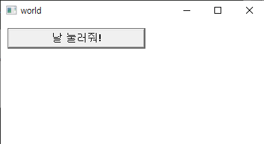
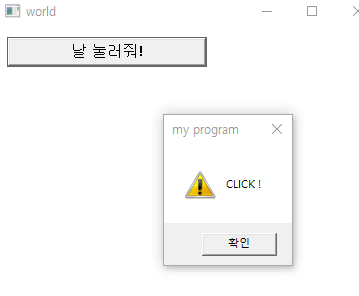

# win32API - 기초

```cpp
#include <windows.h>
/* 윈도우 프로시저 선언 */
LRESULT CALLBACK WndProc (HWND, UINT, WPARAM, LPARAM);
```

HWND : GUI요소를 위해 사용되는 인자. 어떤 윈도우에서 콜백이 발생하는지를 지정

UINT : Unsigned Int . 어떤 종류의 메시지인지 메지시 아이디를 인자로 넘김

WPARAM, LPARAM : 윈도우가 메시지에 자료를 추가할 떄 사용하는 매개변수 

- wparam : word로 넘기는 데이터 . 주로 핸들이나 정수를 전달할 때 사용
- lparam : long 으로 넘기는 데이터. 주로 포인터 값을 전달할 때 사용

```cpp
#define IDBUTTON 102

/* 클래스 이름을 전역 변수로 생성 */
TCHAR szClassName[] = TEXT("MyFirstProgram");
HINSTANCE g_hInst;
```

IDBUTTON : GUI 컨트롤 ID를 위한 기본 정의로, 버튼이 클릭되었을 떄 실행할 일을 연결할 떄 사용함. 

szCalssName : 윈도우 운영체제 내에서 프로그램 등록에 필요한 클래스의 이름임. 

HINSTANCE : 프로그램의 인스턴스. GUI가 어떤 프로그램에 소속되어있는지를 정의하기 위해 사용됨. 

```cpp
int WINAPI WinMain (HINSTANCE hInstance,
                    HINSTANCE hPrevInstance,
                    LPSTR lpCmdLine,
                    int nCmdShow)
{
  HWND hWnd;                    /* 윈도우를 위한 처리기 */
  MSG msg;                      /* 프로그램에 전송된 메시지가 저장 */
  WNDCLASSEX wcex;              /* windowclass를 위한 자료 구조체 */
```

WinMain은 일반 C 프로그램의 main 함수와 같은 동작을 함. 프로그램 시작시에 실행될 함수임.

- HINSTANCE hInstance : 리소스에 접근할 수 있는 핸들 인스턴스.
- HINSTANCE hPrevInstance : 자신이랑 동일한 프로그램이 실행중이라면 그 값을 넘겨받는 핸들
- LPSTR lpCmdLine : 인터페이스 생성후 사용시에 전에 테스트할때 사용되는 됨.
- int nCmdShow : 실행용 인자

HWND는 프로그램의 메인 윈도우가 될 처리기이고, 메시지 처리를 담당할 MSG, 프로그램 정보를 등록할 때 쓰이는 구조체인 WNDCLASSEX. 

- 컴파일시 오류 C28251 : winmain에 대한 주석이 일치하지 않습니다 → 프로젝트 속성 - 링커- 시스템-하위시스템 을 콘솔에서 창으로 변경

```cpp
//윈도우 구조체
	g_hInst = hInstance;
	wc.hInstance = hInstance;
	wc.lpszClassName = szClassName; //클래스 이름 
	wc.lpszMenuName = NULL; //프로그램의 메뉴 사용 안함
	wc.lpfnWndProc = WndProc; //호출하는 주체가 윈도우 
	wc.style = CS_DBLCLKS; //동작의 특성 지정. 더블클릭 잡아냄
	wc.cbSize = sizeof(WNDCLASSEX);

	wc.hIcon = LoadIcon(NULL, IDI_APPLICATION); //아이콘 핸들. 아이콘 지정 
	wc.hIconSm = LoadIcon(NULL, IDI_APPLICATION); //작은아이콘 핸들. 작게 보일 아이콘 지정
	wc.hCursor = LoadCursor(NULL, IDC_ARROW); //커서 핸들. 기본 마우스 커서 사용 
	wc.cbClsExtra = NULL; //윈도우 클래스 뒤에 여유 바이트 없음 
	wc.cbWndExtra = NULL; //윈도우 인스턴스 또는 구조체 

	//창 배경으로 윈도우 기본 색상 사용 
	wc.hbrBackground = (HBRUSH)(COLOR_WINDOW + 1);

	//wc를 윈도우 클래스로 등록, 실패 시 프로그램 종료
	if (!RegisterClassEx(&wc))
		return 0;
```

```cpp
HWND hWnd = CreateWindow(szClassName, L"world",
		WS_OVERLAPPEDWINDOW, 100, 90, 400, 350, NULL, NULL, hInstance, NULL);
	ShowWindow(hWnd, SW_SHOW);
	UpdateWindow(hWnd);
```

- 창을 생성. 인자는 순서대로 윈도우의 이름, 위에 들어갈 타이틀명, 윈도우 스타일, 프로그램이 화면에 표시될 위치 좌표 인자 둘, 창 너비, 창 넓이, 부모창, 메뉴, 프로그램 인스턴스, 생성 자료 이다.
- 이때 윈도우의 이름은 wc.plszClassName과 동일하게 지정해주어야 한다.
- showWindow는 창을 어떤 상태로 보여줄 것인지를 지정한다.
- UpdateWindow는 시스템 리소스가 부족해지더라도 프로그램의 갱신을 중단하지 않을것을 정의한다.

```cpp
LRESULT CALLBACK WndProc(HWND hWnd, UINT message, WPARAM wParam, LPARAM lParam)
{
	HWND hWndButton;
	switch (message) {
	case WM_COMMAND: {
		if ((HWND)lParam && ((HIWORD(wParam) == BN_CLICKED))) {
			int iMid;
			iMid = LOWORD(wParam);
			switch (iMid) {
			case IDBUTTON: {
				MessageBox(hWnd, TEXT("CLICK !"), TEXT("my program"), MB_OK | MB_ICONEXCLAMATION);
				break;
			}
			default:
				break;
			}

		}
		break;
	}
	case WM_CREATE: {
		hWndButton = CreateWindowEx(0,  /* 더 또는  '확장된' 모양 */
			TEXT("BUTTON"),             /* 만들고픈 GUI '클래스' */
			TEXT("날 눌러줘!"),          /* GUI 자막(Caption) */
			WS_CHILD | WS_VISIBLE | BS_DEFPUSHBUTTON, /* 컨트롤 모양은 |로 분할 */
			10,                         /* 좌측 위치 (좌측으로부터의 위치) */
			10,                         /* 상단 위치 (상단으로부터의 위치) */
			200,                        /* 컨트롤의 너비 */
			30,                         /* 컨트롤의 높이 */
			hWnd,                       /* 부모 창 처리 */
			(HMENU)IDBUTTON,            /* WM_COMMAND를 위한 컨트롤의 ID */
			g_hInst,                    /* 응용프로그램 인스턴스 */
			NULL);
		break;
	}
	case WM_DESTROY: {
		MessageBox(hWnd, TEXT("destroy! "), TEXT("my program"), MB_OK | MB_ICONEXCLAMATION);
		PostQuitMessage(0);
		break;
	}
	case WM_CLOSE: {
		MessageBox(hWnd, TEXT("close!"), TEXT("my program"), MB_OK | MB_ICONEXCLAMATION);
		PostQuitMessage(0);
		break;
	}
	default:
		return DefWindowProc(hWnd, message, wParam, lParam);
	}
}
```

몇가지만 짚어보면, switch - case문으로 구분하여 message의 종류에 따라 다른 동작을 수행하게 끔 구분할 수 있다. 

- DefWindowProc을 사용하면 처리되지 않은 메시지들을 다 몰아서 처리하게끔 해준다.
- WM_DESTROY와 WM_CLOSE 모두 프로그램의 x창을 눌렀을때에 호출되는 이벤트로써, 서로 메시지가 전달되는 시점이 다르다.
    - CLOSE의 경우 창이 닫히기 전에 메시지가 전달되며, 대표적인 예시로 이 이벤트에 대응하여 창을 닫을 것 인지 물어보는 창을 띄울 수 있다.  메시지 박스가 뜬다.
    - DESTROY는 창이 닫힐 때 메시지가 전달되며, 프로그램을 종료한 다음에 해야하는 할당 해제, 파일 삭제 등의 동작을 주로 실행한다.  메시지 박스가 뜨지 않음.
- WM_QUIT은 postQuitMessage 함수 호출에 의해 발생하며 GetMessage함수가 0을 리턴하게 하여 메시지 루프를 종료시키는 역할를 한다.  즉 PostQuitMessage(0)을 실행하면 WM_QUIT이 전달되어 GetMessage 루프를 종료한다는 뜻.
- WM_CREATE는 새로운 윈도우가 생성될 때 전달되는 메시지로, 윈도우가 최초 생성 될 떄 한번만 전달되는 메시지이다.  즉, 이 이벤트에 대응하여 동작을 만드는 건 창이 최초로 뜰때 이 동작을 실행하라는 의미.  프로그램의 기본적인 초기화 작업을 수행 하기에 알맞다.

실행시



클릭하면



x로 닫으면 


